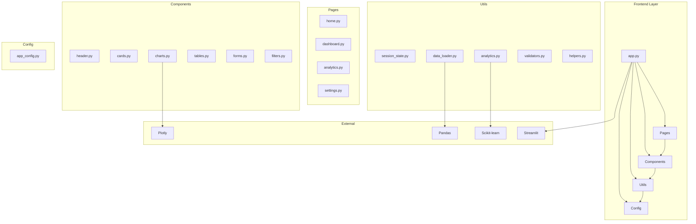
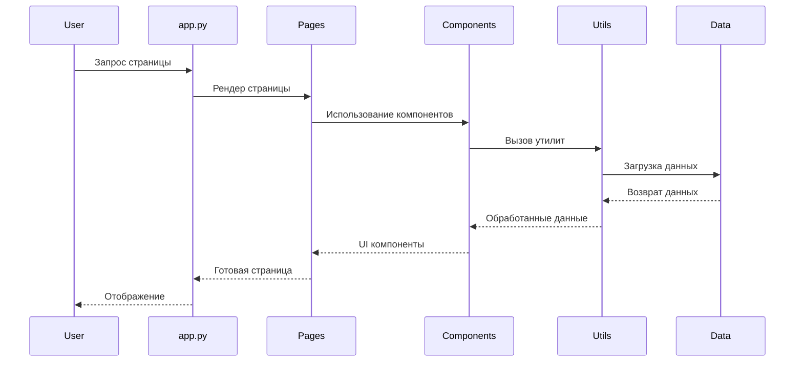

# Архитектура Frontend App

## Диаграмма архитектуры



## Слои архитектуры

### 1. Presentation Layer (Слой представления)

- **app.py** - Главный файл приложения, точка входа
- **Pages** - Страницы приложения (home, dashboard, analytics, settings)
- **Components** - Переиспользуемые UI компоненты

### 2. Business Logic Layer (Слой бизнес-логики)

- **Utils** - Утилиты и вспомогательные функции
- **Analytics** - Аналитические функции и алгоритмы
- **Validators** - Валидация данных

### 3. Data Layer (Слой данных)

- **Data Loader** - Загрузка и обработка данных
- **Session State** - Управление состоянием приложения
- **Cache** - Кэширование данных

### 4. Configuration Layer (Слой конфигурации)

- **App Config** - Настройки приложения
- **Environment Variables** - Переменные окружения

## Поток данных



## Принципы архитектуры

### 1. Модульность

- Каждый модуль имеет четко определенную ответственность
- Слабая связанность между модулями
- Высокая сплоченность внутри модулей

### 2. Разделение ответственности

- **UI Layer**: Отображение и взаимодействие с пользователем
- **Business Layer**: Бизнес-логика и обработка данных
- **Data Layer**: Работа с данными и состоянием
- **Config Layer**: Конфигурация и настройки

### 3. Расширяемость

- Легкое добавление новых страниц
- Расширяемая система компонентов
- Гибкая конфигурация

### 4. Переиспользование

- Общие компоненты для всех страниц
- Утилиты для различных задач
- Централизованная конфигурация

## Структура файлов

```
frontend/
├── app.py                    # Точка входа
├── run.py                    # Скрипт запуска
├── requirements.txt          # Зависимости
├── .streamlit/              # Конфигурация Streamlit
│   └── config.toml
├── src/                     # Исходный код
│   ├── components/          # UI компоненты
│   ├── pages/              # Страницы
│   ├── utils/              # Утилиты
│   └── config/             # Конфигурация
├── static/                 # Статические файлы
├── tests/                  # Тесты
└── docs/                   # Документация
```

## Зависимости

### Основные

- **Streamlit** - Веб-фреймворк
- **Pandas** - Обработка данных
- **NumPy** - Численные вычисления
- **Plotly** - Визуализация

### Аналитика

- **Scikit-learn** - Машинное обучение
- **SciPy** - Научные вычисления

### Разработка

- **Pytest** - Тестирование
- **Black** - Форматирование кода
- **Flake8** - Линтинг

## Конфигурация

### Переменные окружения

- `STREAMLIT_THEME` - Тема оформления
- `STREAMLIT_LANGUAGE` - Язык интерфейса
- `CACHE_TTL` - Время жизни кэша
- `MAX_FILE_SIZE` - Максимальный размер файла

### Настройки приложения

- Тема и внешний вид
- Языковые настройки
- Параметры данных
- Настройки безопасности
- Конфигурация уведомлений

## Безопасность

### Аутентификация

- Простая система входа
- Управление сессиями
- Таймаут сессий

### Валидация

- Проверка входных данных
- Санитизация данных
- Валидация файлов

### Конфигурация

- Централизованные настройки безопасности
- Переменные окружения для секретов
- Валидация конфигурации
